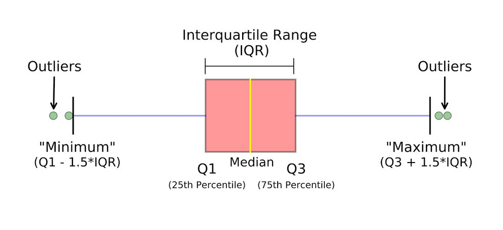
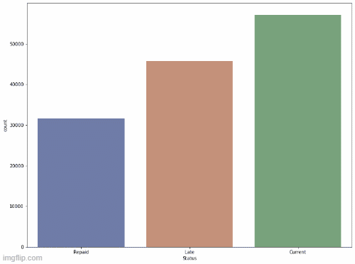
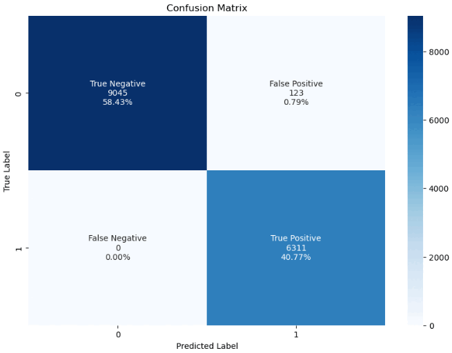
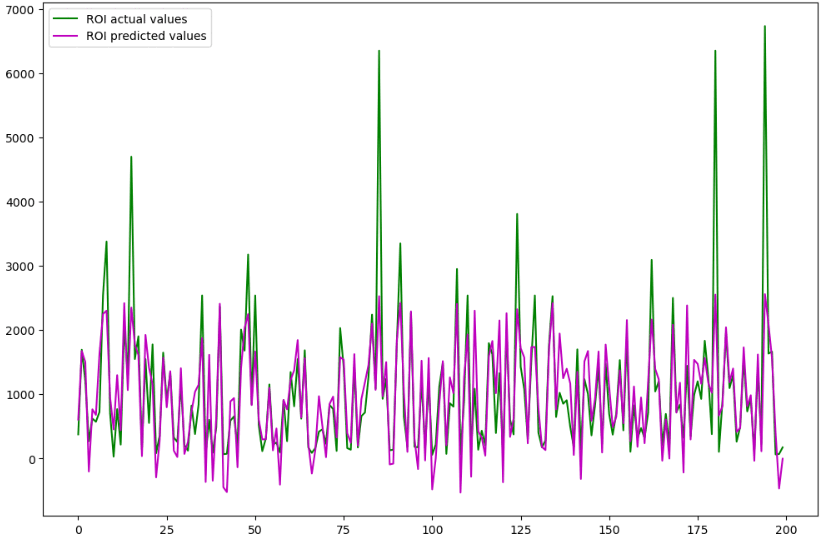
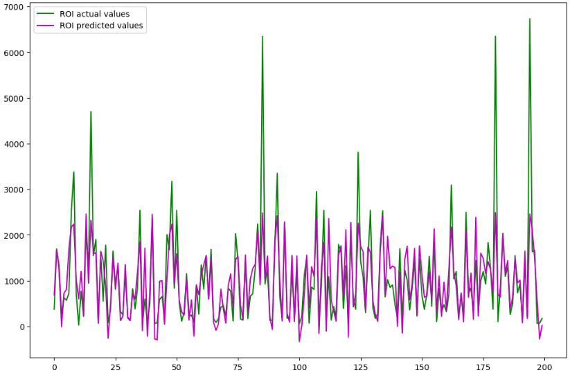
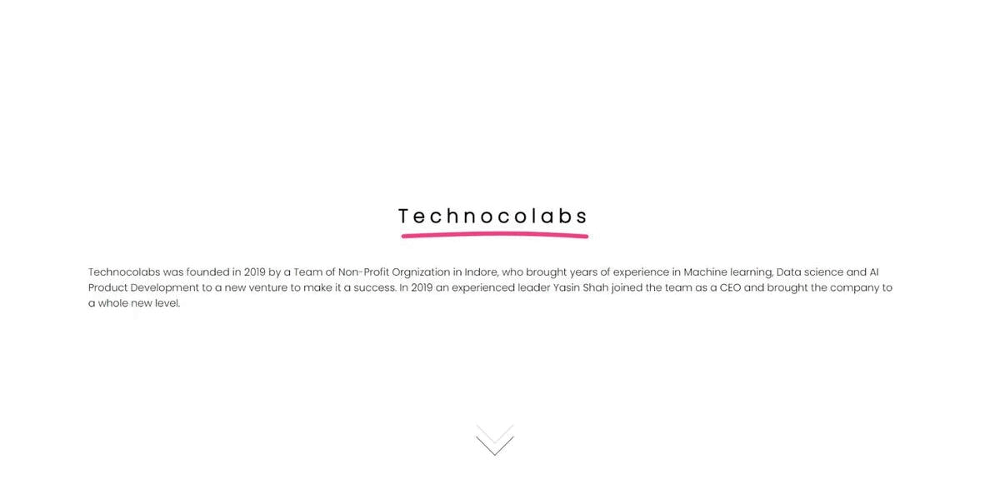

# Project-Bondora-Financial-risk-modelling-of-European-P2P-lending-platform
The main purposes of this analysis are to summarize the characteristics of variables that can affect the loan status and to get some ideas about the relationships among variables.

## Project Summary
### Abstract
In this project we will be doing credit risk modelling of peer to peer lending Bondora systems.Data for the study has been taken from a leading European P2P lending platform [Bondora](https://www.bondora.com/en/public-reports#dataset-file-format). The retrieved data is a pool of both defaulted and non-defaulted loans from the time period between 1st March 2009 and 27th January 2020. The data comprises of demographic and financial information of borrowers, and loan transactions.In P2P lending, loans are typically uncollateralized and lenders seek higher returns as a compensation for the financial risk they take. In addition, they need to make decisions under information asymmetry that works in favor of the borrowers. In order to make rational decisions, lenders want to minimize the risk of default of each lending decision, and realize the return that compensates for the risk.

### Background of Understanding the Problem
Peer-to-peer lending has attracted considerable attention in recent years, largely because it offers a novel way of connecting borrowers and lenders. But as with other innovative approaches to doing business, there is more to it than that. Some might wonder, for example, what makes peer-to-peer lending so different–or, perhaps, so much better–than working with a bank, or why has it become popular in many parts of the world.

Certainly, the industry has witnessed strong growth in recent years. According to Business Insider, transaction volumes in the U.S. and Europe, the world’s leading P2P markets, have expanded at double and, in some cases, triple-digit percentage rates, bolstered by widespread acceptance of doing business online and a supportive regulatory environment.

For investors, "peer-2-peer lending," or "P2P," offers an attractive way to diversify portfolios and enhance long-term performance. When they invest through a peer-to-peer platform, they can profit from an asset class that has proven itself in both good times and bad. Equally important, they can avoid the risks associated with putting all their eggs in one basket, especially at a time when many experts believe that traditional favorites such as stocks and bonds are riskier than ever.

Default risk has long been a significant risk factor to test borrowers’ behaviour in Peer-to-Peer (P2P) lending. In P2P lending, loans are typically uncollateralized and lenders seek higher returns as compensation for the financial risk they take. In addition, they need to make decisions under information asymmetry that works in favor of the borrowers. In order to make rational decisions, lenders want to minimize the risk of default of each lending decision and realize the return that compensates for the risk.

As in the financial research domain, there are very few datasets available that can be utilized for building and analyzing credit risk models. This dataset will help the research community in building and performing research in the credit risk domain.

**Reasons why a loan could be rejected:**
* Credit score was too low
* Debt-to-income ratio was too high
* Tried to borrow too much
* Income was insufficient or unstable
* Didn’t meet the basic requirements
* Missing information on the application
* Loan purpose didn’t meet the lender’s criteria


## Data Wrangling
### Discover The Data

* Data has 134529 records and 112 columns.

* Data has no duplicates.

### Cleaning The Data

We will start by dropping the columns that has more than `40%` missing values.
```python
for i in df.columns:
  percentage_of_missing_data = int((df[i].isnull().sum() / df.shape[0])* 100)
  if  percentage_of_missing_data >= 40:
    print(f'{i}: {percentage_of_missing_data}% missing values.')
    df.drop(columns = [i], inplace = True)
```
`BiddingStartedOn` and `ListedOnUTC` columns are almost identical with only 2% difference so we will drop one of them and the `LoanApplicationStartedDate` column is also almost identical with only `18%` difference (even the differences are only from one to two days) between it and the BiddingStartedOn.
So we will drop the `BiddingStartedOn` and `ListedOnUTC` columns.

These columns: `LoanId`, `LoanNumber` and `UserName` will not affect our predictions and they don't have an impact on the analysis, with that being said we will drop them.

### Handling Missing Values
We filled the NaN values using 2 techniques:
* **Impute with median value:** For the numerical column, We can also replace the missing values with median values. In case you have extreme values such as outliers it is advisable to use the median approach.
* **Impute with mode value:** For the categorical column, We can replace the missing values with mode values i.e the frequent ones.
```python
num_imp = SimpleImputer(strategy = 'median')
df[numerical_columns]= num_imp.fit_transform(df[numerical_columns])

cat_imp = SimpleImputer(strategy = 'most_frequent')
df[categorical_columns]= cat_imp.fit_transform(df[categorical_columns])
```
### Creating New Target Variables For The Regression Model
We Created 3 new target columns to predict the Financial Risk of a loan.
* EMI (Equated Monthly Installment)
* ELA (Eligible Loan Amount)
* ROI (Return On Investment)

**EMI (Equated Monthly Installment)**

An equated monthly installment (EMI) is a fixed payment amount made by a borrower to a lender at a specified date each calendar month. Equated monthly installments are applied to both interest and principal each month so that over a specified number of years.

The formula to calculate EMI = P x R x (1+R)^N / [(1+R)^N-1]  

* “P” is the amount
* “N” in tenure in months
* “R” is the interest rate.


```python
df['EMI'] = df['Amount']*df['Interest']*(1+df['Interest'])**df['LoanDuration'] / ((1+df['Interest'])**df['LoanDuration']-1)
```

**ELA (Eligible Loan Amount)**

Formula: ELA = Total Income - Total Liabilities.
```python
df['ELA'] = df['IncomeTotal'] - df['LiabilitiesTotal']
```

**ROI (Return On Investment)**

When you put money into an investment or a business endeavor, ROI helps you understand how much profit or loss your investment has earned.

Return on investment is a simple ratio that divides the net profit (or loss) from an investment by its cost. Because it is expressed as a percentage, you can compare the effectiveness or profitability of different investment choices.

Formula: 
* ROI = (Net Profit / Cost of Investment) x 100
* ROI = Loan Amount * Interest Rate / 100
```python
df['ROI'] = df['Amount'] * df['Interest'] / 100
```
### Detecting and Removing Outliers
An outlier is a point or set of data points that lie away from the rest of the data values of the dataset. That is, it is a data point(s) that appear away from the overall distribution of data values in a dataset.

Outliers are possible only in continuous values. Thus, the detection and removal of outliers are applicable to regression values only.

A simple way of representing statistical data on a plot in which a rectangle is drawn to represent the second and third quartiles, usually with a vertical line inside to indicate the median value. The lower and upper quartiles are shown as horizontal lines either side of the rectangle.


```python
for i in numerical_columns:
  sns.boxplot(x=df[i])
  plt.show();
```


We created a function `remove_outliers` that returns the `lower limit` and the `upper limit` so we can use them as thresholds to remove the `outliers`.
```python
def remove_outliers(colu):
  sorted(colu)
  Q1,Q3 = colu.quantile([0.25,0.75])
  IQR = Q3 - Q1
  lower_limit = Q1 - (1.5*IQR)
  upper_limit = Q3 + (1.5*IQR)
  return lower_limit, upper_limit
```
```python
for i in numerical_columns:
  low_limit_col, up_limit_col = remove_outliers(df[i])
  df[i] = np.where(df[i] > up_limit_col, up_limit_col, df[i])
  df[i] = np.where(df[i] < low_limit_col, low_limit_col, df[i])
```

## Exploratory Data Analysis (EDA)
We have analysed multiple columns in EDA to gain more knowledge about the given dataset.

#### Status:
We have 3 unique values in the `Status` column:

- `Repaid`: Loan repayment is the act of settling an amount borrowed from a lender along with the applicable interest amount.
- `Late`: The loan has one or more interest payments which are late. Overdue – there has been a delay of more than a day on the scheduled repayment date of the loan.
- `Current`: Current means The borrower is making payments on time. Grace period is a set number of days after the due date during which payment may be made by the borrower without penalty.
#### Gender:
- Encoded gender column with `0` and `1` and then checked the correlation with `Status` column.
- Bar chart clearly shows that the number of `Male` users are around `60%` and `Females` are `40%` appox.
- Then we also checked the correlation of `Status`, `Gender` and `interest` columns in the barplots.
- Checked the visual representation of `Status`, `Gender` and `Age` column all together.
#### Country:
- Checked the visual representation of `Status` counts with respect to `Country`.
- Bar Chart shows that almost `65%` to `75%` of is from the people who lives in `Estonia` and rest belongs to `Finland` and `Spain`. And a very few people belongs to `Slovakia`.
#### Education:
- Checked the visual representation of gender counts with respect to level of Education.
- In the `Education` part we can see that the number of `Male` counts are almost double of `Female` counts.
- Then also checked the `Status` counts with respect to level of `Education`.
- We can see in the Bar charts that the `Secondary`, `Higher` and `Vocational` Education have the higher numbers.
### All the EDA Graphs




## Feature Engineering and Data Pre-Processing:
### Pearson Correlation
The Pearson correlation measures the strength of the linear relationship between two variables. It has a value between -1 to 1, 
* -1 meaning a total negative linear correlation 
* 0 being no correlation, and + 1 meaning a total positive correlation


```Python
def correlation(data, threshold):
  feature_correlation = set()
  correlation_matrix = data.corr()
  for i in range(len(correlation_matrix.columns)):
    for j in range(i):
      if abs(correlation_matrix.iloc[i, j]) > threshold:
        column_name = correlation_matrix.columns[i]
        feature_correlation.add(column_name)
  return feature_correlation
```
The function mentioned above accepts a dataset in the form of a pandas DataFrame, along with a threshold value. It then identifies and returns a set of features that have a correlation coefficient higher than the specified threshold. To avoid overfitting our model, we can choose to remove columns that do not contribute significantly to the model's accuracy.

```Python
current_Index = df[df['Status']=='Current'].index
data = df.drop(current_Index)
data['Status'] = data['Status'].replace({'Late':'Default','Repaid':'Not Default'})
```
We are dropping all the rows with the `Status` column equal to `Current` from our `df` and assigning the remaining data to a new DataFrame named `data`. Then, we are replacing the values `Late` with `Default` and `Repaid` with `Not Default` in the `Status` column of the `data` DataFrame.

### Mutual Information
```Python
def make_mi_scores(X, y, discrete_features):
    mi_scores = mutual_info_classif(X, y, discrete_features=discrete_features)
    mi_scores = pd.Series(mi_scores, name="MI Scores", index=X.columns)
    mi_scores = mi_scores.sort_values(ascending=False)
    return mi_scores
```
The function mentioned above calculates mutual information scores using the mutual_info_classif function from scikit-learn, which measures the dependence between two variables. The function returns a pandas Series object called mi_scores containing the mutual information scores for each feature in X, sorted in descending order.

## Machine Learning Modeling
### Choosing the Features
We chose 15 features for our analysis. We selected 10 features based on their mi scores and chose the 5 remaining features based on the 3 new created target variables.
 * InterestAndPenaltyBalance
 * PrincipalBalance
 * PrincipalPaymentsMade
 * PrincipalOverdueBySchedule
 * NextPaymentNr
 * StageActiveSince_week
 * StageActiveSince_month
 * StageActiveSince_day
 * NrOfScheduledPayments
 * MaturityDate_Last_year
 * Amount
 * Interest
 * IncomeTotal
 * LiabilitiesTotal
 * LoanDuration
 
 
### Classification Models
#### Evaluation Metrics :mag:
* Accuracy: What proportion of actual positives and negatives is correctly classified?
* Precision: What proportion of predicted positives are truly positive ?
* Recall: What proportion of actual positives is correctly classified ?
* F1 Score : Harmonic mean of Precision and Recall

#### Logistic Regression 
`Logistic Regression` is a classification technique used in machine learning. It uses a logistic function to model the dependent variable. The dependent variable is dichotomous in nature, in our case there could only be two possible classes `Defaulted` or `Not Defaulted`.

#### Random Forest Classifier
A `random forest` is a meta estimator that fits a number of decision tree classifiers on various sub-samples of the dataset and uses averaging to improve the predictive accuracy and control over-fitting. The sub-sample size is controlled with the `max_samples` parameter if `bootstrap=True` (default), otherwise the whole dataset is used to build each tree.

 
#### Applying The Models
We started by splitting the data to 80% train and 20% test. We used a `Pipeline` to perform multiple operations in a sequence, for each element of an iterable, in such a way that the output of each element is the input of the next.

The `Pipeline` consists of:
* `Normalizer()`
* Classifier()
  * `LogisticRegression()`
  * `RandomForestClassifier()`
```python
Model_class_Pipeline = Pipeline([
    ('scale', Normalizer()),
    ('classifier', Classifier)
])
```
#### Logistic Regression Metrics :mag:
* Accuracy  :arrow_right: `0.992054`
* Precision :arrow_right: `0.980883`
* Recall    :arrow_right: `1`
* F1-Score  :arrow_right: `0.990349`




#### Random Forest Classifier Metrics :mag:
* Accuracy  :arrow_right: `0.999871`
* Precision :arrow_right: `0.999683`
* Recall    :arrow_right: `1`
* F1-Score  :arrow_right: `0.999842`


We will use the `random forest classifier` in our web application because it performed better than the `logistic regression model`.

### Regression Models
#### Evaluation Metrics :mag:
* Mean Absolute Error: magnitude of difference between the prediction of an observation and the true value of that observation.
* Mean Squared Error: measures how close a regression line is to a set of data points. 
* Root Mean Squared Error: the square root of the mean of the square of all of the error.
* R2 Score: the proportion of the variance for a dependent variable that's explained by an independent variable or variables in a regression model.

#### Applying The Models
We started by splitting the data to 80% train and 20% test. We used a `Pipeline` to perform multiple operations in a sequence, for each element of an iterable, in such a way that the output of each element is the input of the next.

The `Pipeline` consists of:
* `Normalizer()`
* Regressor()
  * `LinearRegression()`
  * ` Ridge()`
```python
Model_Reg_Pipeline = Pipeline([
    ('scale', Normalizer()),
    ('classifier', Regressor)
])
```
#### Linear Regression Metrics :mag:
* Mean Absolute Error :arrow_right: `11955.67`
* Mean Squared Error :arrow_right: `1003713881.77`
* Root Mean Squared Error :arrow_right: `31681.44`
* R2 Score :arrow_right: `0.47`




#### Ridge Metrics :mag:
* Mean Absolute Error     :arrow_right: `11834.95`
* Mean Squared Error      :arrow_right: `1054420895.13`
* Root Mean Squared Error :arrow_right: `32471.84`
* R2 Score                :arrow_right: `0.48`




We will use the `ridge model` in our web application because it performed better than the `linear regression`.

## Deployment
For the `Deplyment`, we used `Flask` as a backend framework to build our web application, and `pythonanywhre` as a cloud service.

To access our app click the following [link](http://haniiiatef.pythonanywhere.com/)



## Reference
* [Project Summary](https://technocollabs.gitbook.io/bondora-statistics/)
* [7 Reasons Why Your Personal Loan Was Declined](https://www.lendingtree.com/personal/reasons-why-your-personal-loan-was-declined/)
* [Detectiong Outlier](https://www.askpython.com/python/examples/detection-removal-outliers-in-python)
* [EMI](https://www.investopedia.com/terms/e/equated_monthly_installment.asp)
* [Feature Engineering](https://www.kaggle.com/learn/feature-engineering)
* [Feature Engineering](https://www.analyticsvidhya.com/blog/2021/03/step-by-step-process-of-feature-engineering-for-machine-learning-algorithms-in-data-science/)
* [Logistic Regression](https://towardsdatascience.com/the-perfect-recipe-for-classification-using-logistic-regression-f8648e267592)
* [Random Forest Classifier](https://scikit-learn.org/stable/modules/generated/sklearn.ensemble.RandomForestClassifier.html)
* [Confusion Matrix](https://medium.com/@dtuk81/confusion-matrix-visualization-fc31e3f30fea)
* [Pipeline](https://towardsdatascience.com/building-generator-pipelines-in-python-8931535792ff)
* [Mean Square Error](https://www.simplilearn.com/tutorials/statistics-tutorial/mean-squared-error)
* [Mean Absolute Erro](https://c3.ai/glossary/data-science/mean-absolute-error/)
* [R2 Score](https://www.investopedia.com/terms/r/r-squared.asp)
* [Root Mean Square Error](https://www.sciencedirect.com/topics/engineering/root-mean-squared-error)
* [Website Design Idea](https://codepen.io/designcourse/pen/VwdgYZL)
* [pythonanywhere](https://www.pythonanywhere.com/)
* [Emoji](https://gist.github.com/rxaviers/7360908)


